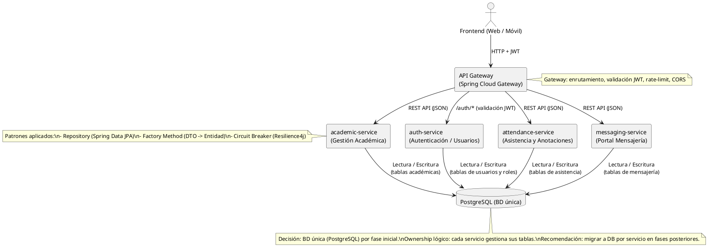
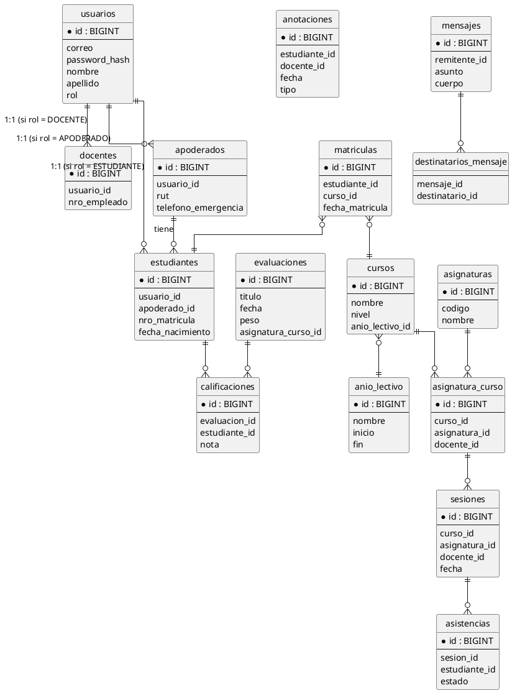

# Arquitectura y Patrones — Plataforma Libro de Clases Digital

Fecha: 2026-03-22 (actualizado)

## Resumen

Documento técnico que amplía el `project_overview.md`. Incluye la descripción de microservicios, patrones aplicados y artefactos (PlantUML y DDL) en formato embebido para copiar/pegar en StarUML o en el entorno de BD.

## Microservicios (lista y responsabilidades)

- auth-service: autenticación y gestión de usuarios y roles (emite JWT).
- academic-service: gestión académica (cursos, asignaturas, matrículas, evaluaciones, calificaciones).
- attendance-service: sesiones, registro de asistencias y anotaciones de conducta.
- messaging-service: mensajería interna (mensajes, destinatarios y adjuntos).
- API Gateway: punto de entrada (Spring Cloud Gateway). Valida JWT, enruta y aplica políticas transversales (rate limiting, CORS).

## Decisiones principales

- Lenguaje: Java + Spring Boot
- Persistencia: PostgreSQL (BD única por fase inicial)
- Comunicación: REST HTTP/JSON entre frontend y microservicios; Gateway centralizado
- **Identificadores**: `BIGINT` auto-incremental (`GENERATED BY DEFAULT AS IDENTITY`). Se eligió esta estrategia para simplificar el desarrollo y la depuración durante la fase de aprendizaje del proyecto, en lugar de UUIDs.
- Borrado: borrado físico (`ON DELETE CASCADE`) + tabla `auditoria_borrados` para traza mínima
- Patrones: Repository (Spring Data JPA), Factory Method, Circuit Breaker (Resilience4j)

## PlantUML: diagrama de microservicios

Copia el siguiente bloque a un archivo `.puml` o pégalo en un editor PlantUML / StarUML:



## PlantUML: modelo ER (versión simplificada)

Copia el siguiente bloque para generar el ER en PlantUML o para usarlo en StarUML:



## DDL (extracto)

A continuación incluyo el DDL mínimo en SQL (PostgreSQL). Cópialo a un archivo `initial_schema.sql` si quieres ejecutar en tu BD de pruebas.

```sql
-- Usaremos IDs auto-incrementales para simplificar el desarrollo.
-- La extensión "uuid-ossp" ya no es necesaria.

CREATE TABLE usuarios (
  id BIGINT GENERATED BY DEFAULT AS IDENTITY PRIMARY KEY,
  correo varchar(255) UNIQUE NOT NULL,
  password_hash varchar(255) NOT NULL,
  nombre varchar(100),
  apellido varchar(100),
  telefono varchar(50),
  rol varchar(30),
  activo boolean DEFAULT true,
  creado_en timestamptz DEFAULT now(),
  actualizado_en timestamptz DEFAULT now()
);

-- (El resto del DDL se encuentra en `ddl/initial_schema.sql`.)
```

## Configuración sugerida (snippets rápidos)

### Resilience4j (Circuit Breaker) - ejemplo `application.yml`

```yaml
resilience4j.circuitbreaker:
  instances:
    academicService:
      registerHealthIndicator: true
      ringBufferSizeInClosedState: 10
      ringBufferSizeInHalfOpenState: 2
      waitDurationInOpenState: 10s
      failureRateThreshold: 50
```

### JWT - Spring Security (snippet básico)

```java
http
  .csrf().disable()
  .authorizeRequests()
    .antMatchers("/auth/**").permitAll()
    .anyRequest().authenticated()
  .and()
  .addFilterBefore(new JwtAuthenticationFilter(jwtUtil), UsernamePasswordAuthenticationFilter.class);
```

## Observabilidad y despliegue

- Métricas: Micrometer + Prometheus
- Logs: formato JSON centralizado (EFK/ELK)
- Tracing: OpenTelemetry / Jaeger
- Despliegue recomendado: contenedores (Docker) y orquestador (Kubernetes) para escalado horizontal

---

_Nota: si quieres, puedo extraer el DDL completo aquí en este archivo o crear el archivo `ddl/initial_schema.sql` en el repo. Dime cómo lo prefieres._
